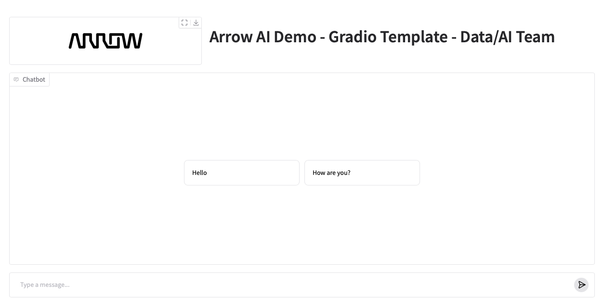

# Arrow AI Demos - Gradio Template 

This repo is a simple Gradio template that includes Arrow Logo and demo title. The purpose of this repo is to create reusable Gradio template for various demos with Arrow branding.  

## Installation 

Create Python venv: 

    python3 -m venv .venv 

Activate the venv: 

    source .venv/bin/activate

Install requirements: 

    pip install -r requirements.txt 

or just install Gradio:  

    pip install gradio 

Run the python file: 

    python3 gradio-template.py

Open the following local URL: http://127.0.0.1:7861

    

